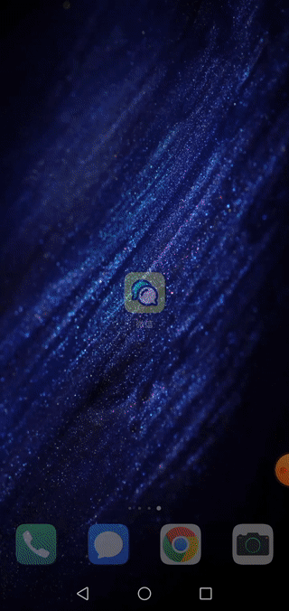

# 用 Jetpack Compose 组装一个微信 UI

## 效果图

## 介绍
该项目是 [iOS版 SwiftUI-WeChatDemo](https://github.com/wavky/SwiftUI-WeChatDemo) 的对等 Android Jetpack Compose 实现，95% 以上代码逻辑由 SwiftUI 到 Kotlin + Compose 1:1 对照翻译高清还原。部分代码因应平台及 API 差异，独立提供实现。

## 实装内容
* 4 个 Tab 页面 + 聊天界面，使用纯 Compose 搭建而成
* 应用启动界面 Splash Activity
* 国际化
* Coroutines 使用场景（聊天界面简易对话功能）
* 极度简化的 MVVM 架构
* 逻辑部分纯 Kotlin 书写
* 不使用第三方框架

## 难点
* 应用内语言切换功能暂未找到简单直观可行的实现方案，暂且搁置
* 矢量图形的色彩遮罩功能实现（网上未能找到该方面的相关资料，最终与网友讨论研究出解决方案并替换原来的廉价替代实现）
* Compose 提供的 API 及使用方法，与 SwiftUI “神合貌离”，相当一部分的代码逻辑需要转换思路来实现，而 SwiftUI 基于 Swift / OC 语言的数据结构所设计的数据绑定机制，与 Compose 基于 Kotlin 提倡的数据结构所设计的方案相比，更是相去甚远...

## 坑
* 微信整体设计风格偏向于 iOS 应用，不符合 Material Design，导致 Compose 的 Material 库近乎无法使用状态，甚至需要手动剥离 UI 自带的 Material 动效
* Canvas 结合 BlendMode 的使用存在前置条件，而非直观的开箱即用

---

## 彩蛋
应用内包含微信联系方式，欢迎同行交流
